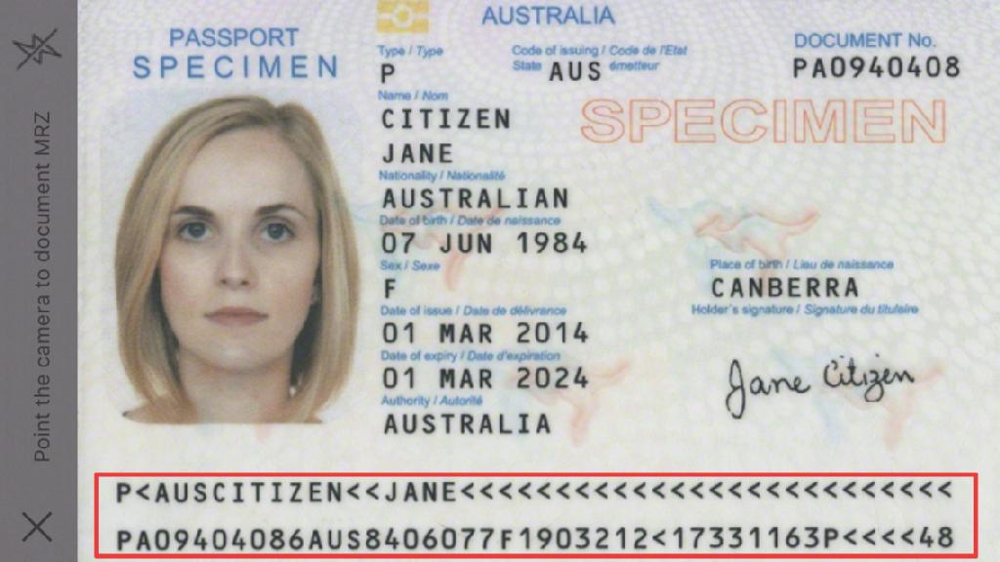

# Regula Document Reader
If you have any questions, feel free to contact us at support@regulaforensics.com



* [How to build demo application](#how_to_build_demo_application)
* [How to use DocumentReader library](#how_to_use_documentreader_library)
* [How to add DocumentReader library to your project](#how_to_add_documentreader_library_to_your_project)
* [Additional information](#additional_information)

## <a name="how_to_build_demo_application"></a> How to build demo application
1. Get trial license for demo application at licensing.regulaforensics.com (`regula.license` file).
1. Clone current repository using command `git clone https://github.com/regulaforensics/RegulaDocumentReader-iOS.git`.
1. Download and install lates [Xcode](https://developer.apple.com/xcode/download).
1. Download latest [DocumentReader.framework](https://github.com/regulaforensics/RegulaDocumentReader-iOS/releases) and copy it to `RegulaDocumentReader` folder.
1. Download [OpenCV-2.4.9](http://sourceforge.net/projects/opencvlibrary/files/opencv-ios/2.4.9/opencv2.framework.zip/download) and copy it to `RegulaDocumentReader` folder.
1. Copy file `regula.license` to `RegulaDocumentReader/DocumentReaderDemo` folder.
1. Open project `RegulaDocumentReader/DocumentReaderDemo.xcodeproj` in Xcode.
1. Select _Product_/ _Build_ menu command.

## <a name="how_to_use_documentreader_library"></a> How to use DocumentReader library
The very first step you should make is install license file:
```swift
let mrzDetector = MRZDetectorIOS()
...
if let licenseFilePath = NSBundle.mainBundle().pathForResource("regula.license", ofType: nil) {
  let licenseData = NSData(contentsOfFile: licenseFilePath)
  let licenseOk = mrzDetector.setLicense(licenseData)
  if licenseOk {
    // License is OK, now we can use DocumentReader library
  } else {
    // License isn't OK, you can see additional information in output
  }
} else {
  // License file not found
}
```

License file contains information about your application id and time terms. If `setLicense()` method returns false, you can see additional information in output.

When the license file is installed, all you need to do is to call only one function to process image:
```swift
static func processMRZ(inImage: UIImage, inputIsSingleImage: Bool = true) -> Bool {
  var outputMrzImage: UIImage? = nil
  var outputMrzCoord: NSMutableArray? = nil
  var outputMrzXml: NSString? = nil
  let errorCode = mrzDetector.detectMRZ(
    inImage, 
    outputMRZImage: &outputMrzImage, 
    outputMRZCoords: &outputMrzCoord, 
    outputXML: &outputMrzXml, 
    writeDebugInfo: false, 
    inputIsSingleImage: inputIsSingleImage)
  return outputMrzXml != nil
}
```
For single image processing parameter _inputIsSingleImage_ should be _true_. For video processing _inputIsSingleImage_ parameter should be _false_. Parameter _outputMrzXml_ contains parsed MRZ line.

## <a name="how_to_add_documentreader_library_to_your_project"></a> How to add DocumentReader library to your project
You can use `DocumentReader.framework` like any other framework.

1. Open your project in Xcode.
1. Drag and drop `DocumentReader.framework` to _Project Navigator_.
1. Check _Destination_ checkbox and select _Create folder references_ in _Added folders_ group.
1. Add bridging header for `DocumentReader.framework`.

## <a name="additional_information"></a> Additional information
If you have any questions, feel free to contact us at support@regulaforensics.com
